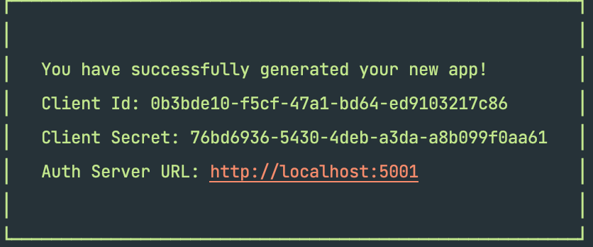

# encryptly-cli
### CLI for generating apps for encryptly.net authentication service

_Installing and updating the CLI_
```
npm i encryptly-cli@latest -g
```

_Installing and updating the SDK_
```
npm i encryptly-auth-sdk

or 

yarn add encryptly-auth-sdk
```

_Installing and updating the client_
```
npm i encryptly-client

or 

yarn add encryptly-client
```

_Usage_
```
encryptly-cli generate:app 
    --server-url "https://auth.encryptly.net" 
    --name "My App"
    --redirect-url "https://example.com/api/auth/oauth/login"
    --url "https://example.com"
```

_Options_

Option | Alias | Description | Required
------ | ----- | ----------- | --------
-s | --server-url | Authentication server url to use | Yes
-n | --name | Your app's name | Yes
-r | --redirect-url | URL that users will be redirected to after successful login | Yes
-u | --url | URL of your app | Yes

_CLI App Generation Result_



You will most likely copy these values into an .env file on your server,
as such:
```
ENCRYPTLY_CLIENT_ID=0b3bde10-f5cf-47a1-bd64-ed9103217c86
ENCRYPTLY_CLIENT_SECRET=76bd6936-5430-4deb-a3da-a8b099f0aa61
ENCRYPTLY_SERVER_URL=http://localhost:5001
```

_What to do after successful login_

There are two ways your users will be redirected to
authentication server:
1. Popup
2. Page redirect

_METHOD 1: Popup_

Your client should open a window using javascript.
```javascript
import { createPopup } from "encryptly-client";

// STEP 1: Create popup (client side)
const authServerUrl = "https://auth.encryptly.net";
const clientId = "<YOUR GENERATED CLIENT ID>";
const type = "login"; // or "register"
const url = authServerUrl + "/auth/" + type + "?clientId=" + clientId;
createPopup({serverUrl, clientId, type}, token => handleEncryptlyResponse(token))

// You will need to create "handleEncryptlyResponse" function
// or whatever you want to call it
// Next step involves verifying the token from "createPopup" response

// STEP 2: Verify token (server side)
// Example: NodeJS express auth controller

const { checkToken } = require("encryptly-auth-sdk");

exports.oauthLogin = async (req, res) => {
    // If you passed the token using ?token=<TOKEN>
    if (!req.query.token) {
        return res.status(400).send({ error: "No token provided" });
    }

    const serverUrl = process.env.ENCRYPTLY_SERVER_URL;
    const clientId = process.env.ENCRYPTLY_CLIENT_ID;
    const clientSecret = process.env.ENCRYPTLY_CLIENT_SECRET;

    const response = await checkToken({
        token: req.query.token,
        serverUrl,
        clientId,
        clientSecret
    });

    // In case of wrong token
    if (response.error) {
        return res.sendStatus(401);
    }

    // User object received from authentication server
    const { _id, displayName, email, firstName, lastName } = response.user;

    // Handle retrieving or adding the user to your own database
    // Or whatever you wish to do with the user object
    let user = await User.findOne({ email: email });
    if (!user) {
        user = new User({
            displayName,
            email,
            oauthId: _id,
            accessLevel: "User",
        });
        await user.save();
    }

    const jwtUserData = {
        userId: user._id,
        userAccessLevel: user.accessLevel,
    };
    const jwtToken = jwt.sign(jwtUserData, process.env.JWT_SECRET);

    res.send({ token: jwtToken });
}
```

_METHOD 2: Page Redirect_

After a successful login, users will be redirected to the
specified redirect URL. This can be useful when the user
is visiting your app on mobile

```javascript
import { redirectToAuthServer } from "encryptly-client";

// STEP 1: Redirect user to authentication server (client side)
const serverUrl = "https://auth.encryptly.net";
const clientId = "<YOUR GENERATED CLIENT ID>";
const type = "login"; // or "register"
const redirectUrl = "<YOUR APP'S SERVER REDIRECT URL>"
redirectToAuthServer({serverUrl, clientId, type, redirectUrl})

// The only difference from the popup method
// is that here you specify "redirectUrl"

// STEP 2: Verify token after successful login (server side)
// This can be done using the same controller method as
// in STEP 2 for popup method, except that you
// will need to redirect to your frontend

// Example (oauth login controller method)
// ...

const jwtUserData = {
    userId: user._id,
    userAccessLevel: user.accessLevel,
};
const jwtToken = jwt.sign(jwtUserData, process.env.JWT_SECRET);
let redirectUrl = req.query.redirectUrl ? req.query.redirectUrl : "/";
redirectUrl = redirectUrl + "?token=" + jwtToken;

return res.redirect(redirectUrl);
```